# **Laboratorio1 De BIG DATA**

- [**Laboratorio1 De BIG DATA**](#laboratorio1-de-big-data)
  - [**Introduccion**](#introduccion)
  - [**Gestion de archivos en EMR**](#gestion-de-archivos-en-emr)
    - [**Creacion del EMR**](#creacion-del-emr)
    - [**Gestion de archivos via HUE**](#gestion-de-archivos-via-hue)
    - [**Gestion de archivos via SSH en el emr**](#gestion-de-archivos-via-ssh-en-el-emr)
    - [**Gestion de archivos S3 via HUE**](#gestion-de-archivos-s3-via-hue)
    - [**Gestion de archivos S3 via SSH**](#gestion-de-archivos-s3-via-ssh)
  - [**Gestion de archivos HDFS en el DCA**](#gestion-de-archivos-hdfs-en-el-dca)
    - [**Gestion de archivos via Ambari**](#gestion-de-archivos-via-ambari)
    - [**Gestion de archivos via SHH**](#gestion-de-archivos-via-shh)
  - [Bucket Publico S3](#bucket-publico-s3)

## **Introduccion**

En este laboratorio se busco la gestion de archivos EN HDSF y AWS S3
tanto por interfaz grafica como por SHH, para esto se hizo uso tanto del servicio EMR de amazon como uso del DCA de la universidad

## **Gestion de archivos en EMR**


### **Creacion del EMR**

Para la creacion del EMR entraremos a la platarforma de AWS y seleccionaremos crear EMR y opciones avazandas.PNG

Seleccionaremos la release emr-6.1.0 y seleccionaremos las siguientes dependencias a instalar

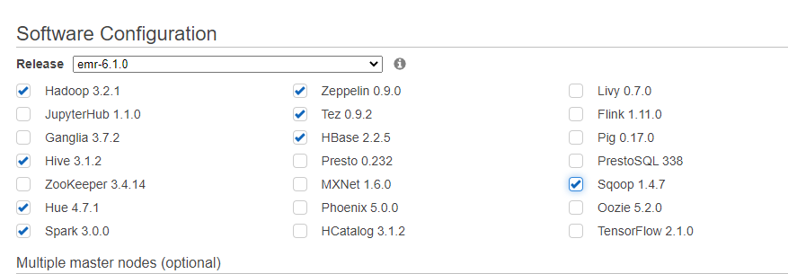

Cambiaremos las maquinas del master y core por maquinas m4.large y seleccionaremos la opcion de Spot

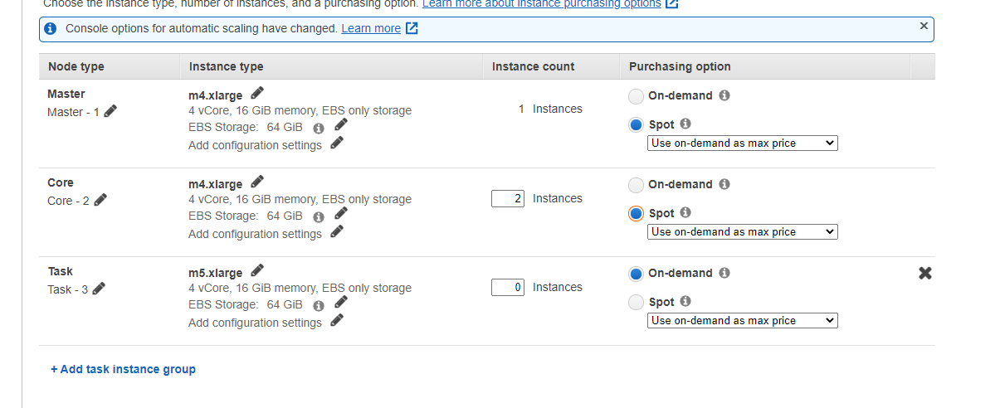

Pondremos el nombre de el cluster y daremos a next

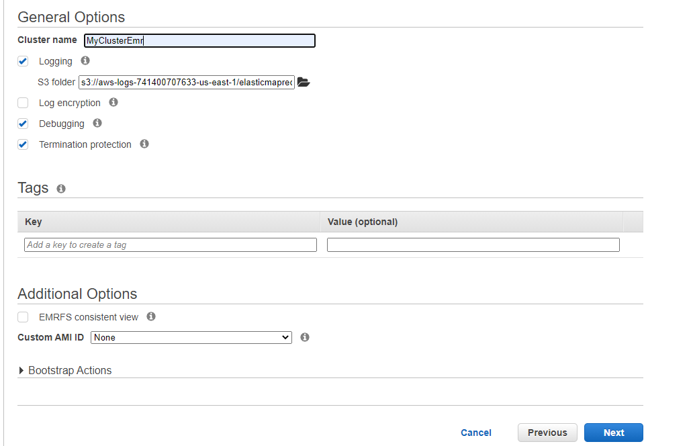

seleccionaremos la clave pem de nuestra preferiencia, si no tiene una clave la puede crear en el apartado de EC2

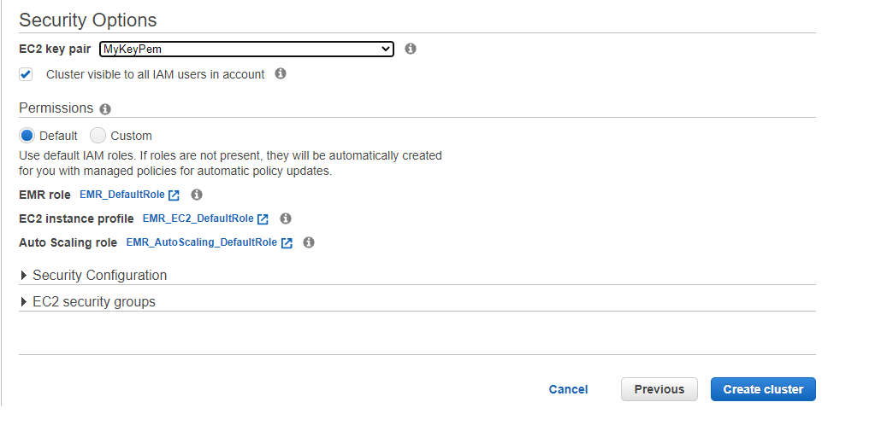

### **Gestion de archivos via HUE**

Para la gestion de archivos via Hue accederemos via el navegador por el url que fue dado por el cluster + el puerto 8888


Dentro de este iremos al apartado de files y ingresaremos al apartado /user/svalenciaa en nuestro caso

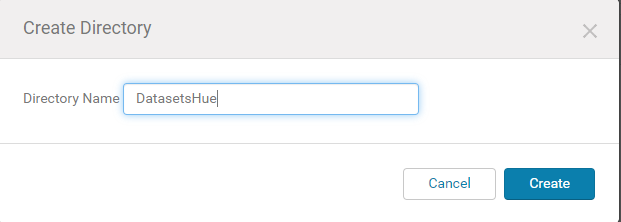

Se nos creare la carpeta y accederemos a esta para subir los archivos

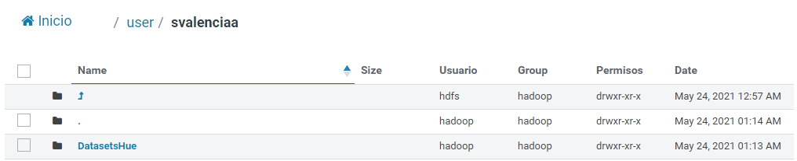

Dentro de esta arrastraremos la carpeta desde nuestro equipo hacia la carpeta con drag and drop, esto subira los archivos dando como resultado lo siguiente

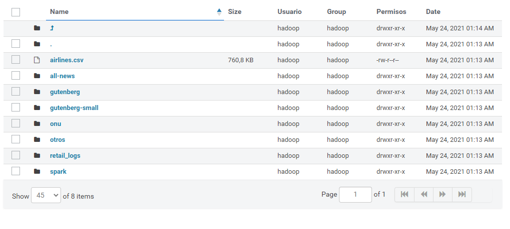

### **Gestion de archivos via SSH en el emr**

Para la gestion de archivos via SSH nos conectaremos al cluster por la direccion dada y con la clave pem que escogimos para esta

```
ssh -i ~/MyKeyPem.pem hadoop@ec2-3-239-49-102.compute-1.amazonaws.com
```
Crearemos el directorio donde almacenaremos los datasets via SSH, y luego mandaremos los archivos que estan almacenados localmente en el servidor gateway para esto, la opcion mas sencilla es clonar un repositrio dentro de este con los datasets para luego enviarlos


Verificamos que los archivos fueron correctamente subidos al HDFS

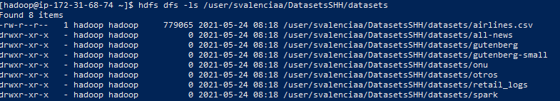

### **Gestion de archivos S3 via HUE**

Para la gestion de S3 debemos acceder al apartado de S3 y crearemos un bucket nuevo

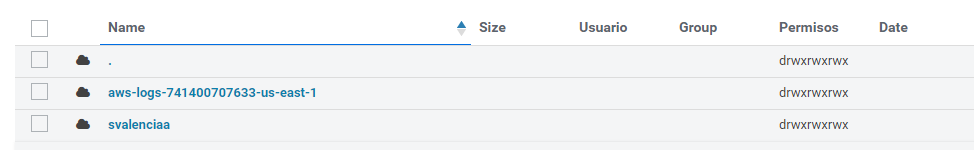

entraremos y crearemos un nuevo directorio y pondremos dentro de este los archivos que queremos subir
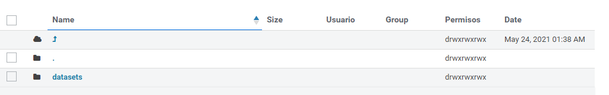

Pasamos a verificar que se hayan subido correctamente

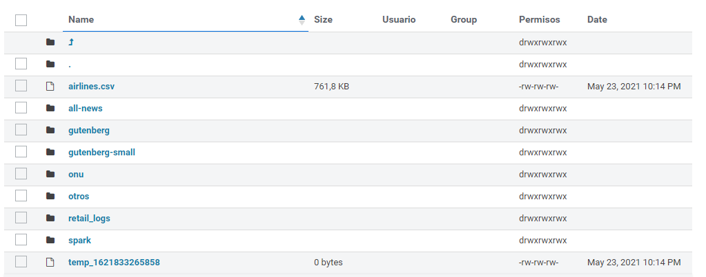

### **Gestion de archivos S3 via SSH**

Para la gestion  de archivos a s3 debemos ingresar via ssh al servidor gateways 

Crearemos la carpeta correspondiente dentro del bucket y prodeceremos a enviar los datos que previamente han sido clonados dentro del servidor
```
hadoop fs -mkdir s3a://svalenciaa/Datasets/datasetsSHH

hadoop fs -copyFromLocal datasets/datasets/* s3a://svalenciaa/Datasets/datasetsSSH
```
Como se evidencia  los datos fueron enviados a s3

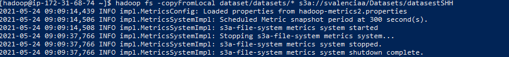

Para verificar ingresaremos el comando correspondiente 
```
hadoop fs -ls s3a://svalenciaa/Datasets/datasetsSHH
```
Se puede verificar que los archivos fueron subidos correctamente


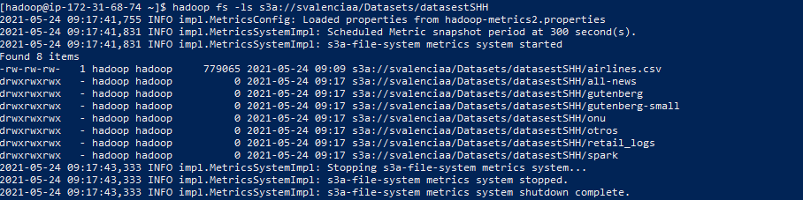

## **Gestion de archivos HDFS en el DCA**

Para la gestion de archivos en DCA se utilizara ambari y conexion ssh
### **Gestion de archivos via Ambari**

Se ingresa a la carpeta correspondiente de el usuario asignado con anterioridad, y se crea un nuelvo folder


Dando como resultado el directorio dentrro de este.

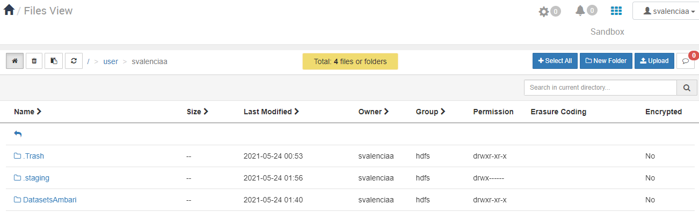

Luego se procede a subir cada uno de los archivos correspondientes, cabe aclarar que a diferencia de hue, ambari solo permita subir 1 archivo a la vez y no permite la subida de carpetas por lo cual hay que crear cada una de estas y ir ingresandolas.

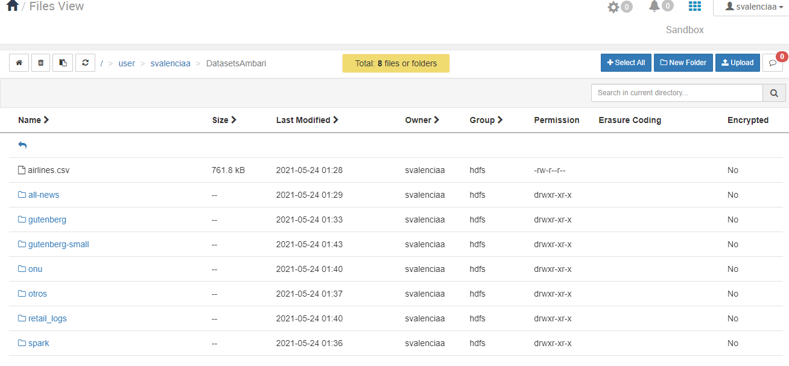

### **Gestion de archivos via SHH**

Para la gestion via SSH , nos conectamos via la herramienta web que fue brindada, nos logeamos y procedemos a hacer una prueba para comprobar que todo funciona

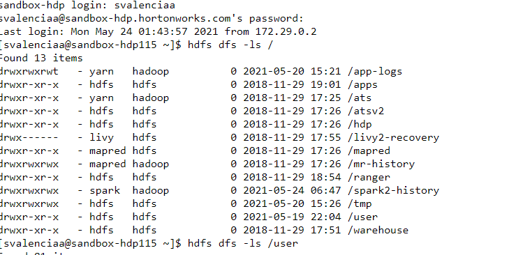

Luego de esto procedemos a crear el directorio donde se almacenara los archivos del dataset


Luego de esto procedemos a enviar los datos del servidor gateway hacia el HDFS


Por ultimo comprobamos que los archivos se cargaron exitosamente

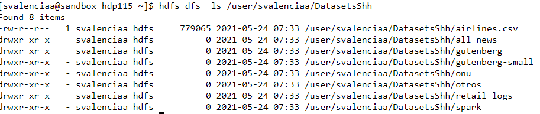


## **Bucket Publico S3**

Para efectos de comprobacion se adjunta la direccion url del bucket 
S3
